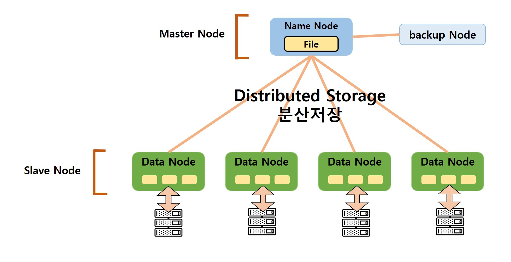

## 하둡(Hadoop) 이론 정리
### 하둡 정의 
- 방대한 데이터를 분산처리하여 저장할 수 있도록 해주는 소프트웨어 프레임워크 입니다.
- 즉 하드웨어가 아닌 소프트웨어를 지칭합니다. 
- Java기반의 오픈소스 프레임워크 입니다.

### 하둡 분산처리 시스템의 특징
1. Data Recoverability(데이터 회복성): 일부 컴퓨터 동작 이상에도 시스템이 정상 동작합니다. 
예전 분산처리 모델의 PF문제를 해결한다. Fault-tolerant라고도 부릅니다.
2. Component Recovery(구성요소 회복): 시스템 일부 구성요소에 이상이 생기고 다시 복구된 경우 
재시작 없이 시스템에 바로 관여해 작업을 수행합니다.
3. Consistency(지속성): 시스템에서 작업이 수행되는 동안 시스템 컴포넌트에 문제가 생겨도 작업에는 영향을 주지 않습니다.
4. Scalable(확장성): 저장할 용량이 늘어나면 컴퓨터 추가 

### 하둡 내부 구성 및 설명

하둡은 단일 서버에서 수천대의 머신으로 확장 할 수 있도록 설계되어 있습니다.  
중앙 시스템(하둡)에 활용성을 높이기 위해 여러가지 소프트웨어를 추가한 모델을 '에코시스템'이라 부릅니다.  
하둡 초기 모델은 HDFS, MapReduce를 포함한 프레임워크로 시작했으나  
데이터저장, 처리, 실행 엔진 등을 포함하는 생태계(EcoSystem) 의미로 확장되었습니다.

- Distributed Coordinator: 분산처리, 분산환경 구성하는 서버 설정을 관리하는 시스템
    - Zookeeper
- Scheduling
- Data Ingestion: 데이터 수집 역할
    - Kafka: 데이터 스트림 실시간 관리하는 분산 시스템,대용량 이벤트처리 가능
- Applications: 데이터 분산처리 작업에 관련된 앱을 포함한다.
    - MapReduce: 대용량 데이터 처리 분산 프로그래밍 프레임워크
    - Hive(하둡기반 데이터분석 솔루션)
    - Spark(빠른 속도로 실행시켜주는 엔진)
    - Pig(데이터를 스크립트로 처리)
    - Impale(Map Reduce 대체하는 하둡기반 신속 분산엔진)
- Storage: 분산 데이터를 저장하는 저장소이다.
    - HDFS
    - HBase(분산DB)
    - Kudu(컬럼기반 스토리지)
- 분산 리소스 관리
    - Yarn: 작업 스케줄링 및 클러스터 리소스 관리 위한 프레임워크이다. MapReduce, Hive, Spark, Impale 등 앱은 얀에서 작업을 실행한다.

### 하둡 동작원리
- MapReduce, HDFS 두 가지 요소가 하둡 동작의 핵심입니다.
    - MapReduce: 대용량 데이터를 처리하는 분산 프로그래밍 모델 프레임워크 입니다.
    - HDFS: 하둡 네트워크에 연결된 기기에 데이터를 저장하는 분산형 파일 시스템 입니다.

### 하둡 탄생 배경 
- 기존의 분산 처리 시스템에는 확장성, PF문제가 있습니다.
- 구글의 연구로 개발 시작
- GFS, MapReduce 기술 등장
- Apache 오픈소스 파운데이션 위에 GFS,MapReduce 기술을 끌어와 소프트 프레임워크를 만들었습니다. 그것이 하둡 기본 모델입니다.

**용어 정리**
- 분산 처리 시스템: 여러개의 머신과 하나의 작업 사이 MPI를 사용하는 시스템
- MPI: Message Passing Interface
- Partial Failures: 분산 처리 시스템이 여러개의 컴퓨터를 사용하는 경우 일부 컴퓨터에서 동작 이상이 발생하면
분산처리 시스템이 동작 하지 않는 것
- GFS: Google File System
- HDFS: Hadoop Distributd File System. 
하둡 네트워크에 연결된 기기에 데이터를 저장하는 분산형 파일 시스템으로 안정적인 공유저장소, 데이터 저장소 입니다. 
- MapReduce: 분산 프로그래밍 프레임워크, 분산 시스템
- 분산 프로그래밍: 
- Top-level
- Core Concept : 핵심개념

 

## 하둡 핵심 구성요소
### 1. HDFS (하둡 분산형 파일 시스템)
- 정의: 하둡 네트워크에 연결된 기기에 데이터를 저장하는 분산형 파일 시스템
- 데이터 저장 방식:
    - 파일 등 데이터를 저장하면 다수의 노드에 복제 데이터를 함께 저장해 데이터 유실을 방지합니다.
    - 저장하려는 파일은 특정 사이즈 블록으로 나뉘어 동일한 서버가 아닌, 분산된 서버 여러개에 저장됩니다. 
    - 블록사이즈는 기본적으로 64MB
    - 파일을 저장하거나 저장된 파일을 조회하려면 스트리밍 방식으로 데이터에 접근해야 합니다.
    - 스트리밍 방식 데이터 접근이란, 파일을 순차적 스트리밍 방식으로 읽습니다.
    - 한번 저장된 데이터는 수정할 수 없으며 읽기만 가능합니다. (데이터 무결성)
    - 수정은 불가능 하지만 파일이동, 삭제, 복사 하는 인터페이스를 제공합니다.
- 
- DataNode는 여러 파일 블록을 저장하고 있다.
- NameNode는 HDFS의 Master역할을 한다. 
    - 파일 시스템의 모든 meta Data를 갖고있다.
    - 실제 작업대상 파일을 블록단위로 나누어 Slave노드에 분배한다.

### 2. MapReduce 
- 정의: 대용량 데이터를 처리하는 분산 프로그래밍 모델 프레임워크
- 역할: computation
    - **HDFS가 분산 저장** 이였다면 **MapReduce는 분산 처리** 기능을 합니다.
    - 대규모 분산 컴퓨팅 환경에서 데이터를 병렬 분석이 가능합니다.
    - 프로그래머가 직접 작성하는 맵과 리듀스 라는 두개의 메소드로 구성됩니다.
    - 맵리듀스 프레임워크는 Map + Reduce 두 가지 형식으로 나누어 집니다.
    - Map(key,value 형태) 함수에서 데이터를 처리합니다. 정확히 말하면 흩어져 있는 데이터를 연관성 있는 데이터들로 분류하는 작업입니다.  (분산처리 과정)
    - Reduce 함수에서 결과값을 계산합니다. 더 정확히 말하면 Map에서 출력된 데이터에서 중복을 제거하고 원하는 데이터를 추춣합니다. (합치는 과정)

---
아래 사이트의 내용을 참고하여 작성된 글 입니다.
- [에코시스템1](https://m.blog.naver.com/PostView.nhn?blogId=acornedu&logNo=220957220179&proxyReferer=https%3A%2F%2Fwww.google.com%2F)
- [에코시스템2](https://12bme.tistory.com/70?category=737765)
- [에코시스템3](https://over153cm.tistory.com/entry/%ED%95%98%EB%91%A1-%EC%97%90%EC%BD%94%EC%8B%9C%EC%8A%A4%ED%85%9CHadoopEcosystem%EC%9D%B4%EB%9E%80)
- https://www.opentutorials.org/course/2908/17055
- https://blog.acronym.co.kr/329
- https://12bme.tistory.com/70
- http://www.incodom.kr/%ED%95%98%EB%91%A1
- https://insightcampus.co.kr/hadoop01/
- https://eehoeskrap.tistory.com/219
- http://www.openwith.net/?p=597
- [HDFS 구조1](https://www.google.com/search?q=HDFS+%EC%95%84%ED%82%A4%ED%85%8D%EC%B2%98&sxsrf=ALeKk00XjKl06WayAyZThLsV8GRU7baKLw:1584778839953&source=lnms&tbm=isch&sa=X&ved=2ahUKEwiw9bWekavoAhWVZt4KHcMRCmgQ_AUoAXoECA0QAw&biw=526&bih=421#imgrc=u630ikwuwxbBHM&imgdii=DgMBWL8a8YJAwM)
- [HDFS 구조2](https://kimyhcj.tistory.com/181)
- [HDFS 구조3](https://zetastring.tistory.com/87)

